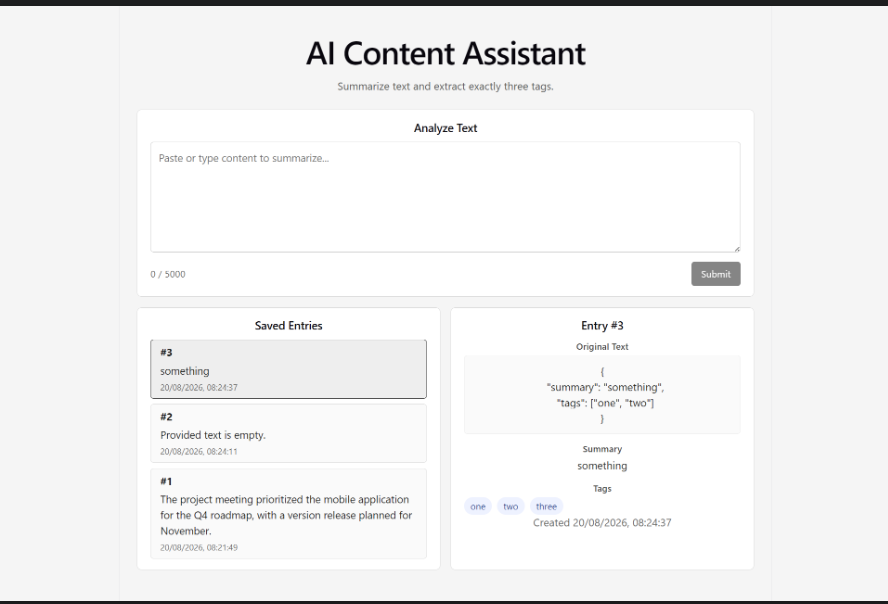

# AI Content Assistant

Small full-stack + applied AI assessment for IIFL Finance Round 1: paste text, get an AI summary and exactly 3 tags, persist to SQLite.

## Stack

| Layer    | Tech                        |
| -------- | --------------------------- |
| Frontend | React + TypeScript + Vite   |
| Backend  | Python + FastAPI            |
| Database | SQLite + SQLAlchemy         |
| AI       | OpenAI Chat Completions API |

No auth, Docker, LangChain, RAG, vectors, or agents.

## Architecture

```
Frontend (React)
  → POST /entries { text }
Backend (FastAPI)
  → validate input (Pydantic)
  → call OpenAI Chat Completions (JSON mode, ~20s timeout)
  → parse + validate { summary, tags[3] } with Pydantic
  → save Entry to SQLite via SQLAlchemy
  → return saved entry
Frontend
  → GET /entries (list) and GET /entries/{id} (detail)
```

## AI choice

- **Provider:** OpenAI
- **Model:** `gpt-4o-mini` (configurable via `OPENAI_MODEL`)
- **Why:** Fast and cost-effective for short summarization/tagging, supports structured JSON responses, and is simple to call with the official Python SDK—no LangChain or agent framework needed for this scope.

## Reliability

| Failure mode              | Handling                                                                 |
| ------------------------- | ------------------------------------------------------------------------ |
| Slow model / hang         | OpenAI client `timeout=20.0` seconds; timeout surfaces as LLM failure    |
| API / network failure     | Caught as `OpenAIError` → HTTP **502** with a clear detail message       |
| Malformed or invalid JSON | `json.loads` + Pydantic `AIAnalysis` → HTTP **502**; entry is not saved  |
| Empty / whitespace input  | Pydantic validation → HTTP **422**                                       |
| Oversized input           | Rejected when over `MAX_INPUT_LENGTH` (default 5000) → HTTP **400**      |

## Privacy

- The full user-submitted text is sent to the OpenAI API as the user message.
- Stored locally in SQLite: `original_text`, `summary`, `tags`, `created_at`.
- In financial services, avoid sending PII, account numbers, KYC documents, passwords, card data, or confidential customer/trading information to a third-party LLM unless contracts, redaction, and retention policies allow it.

## Production next steps (3)

1. Add authentication and authorization so entries are scoped to users/teams.
2. Move secrets and config to a secure secret store; add structured logging and rate limiting around the LLM endpoint.
3. Replace SQLite with a managed database and add retries/circuit-breaking for transient LLM failures.

## AI coding tools

Built with **Cursor** (and ChatGPT for clarifying assignment wording where useful). Output was validated by:

- Running the app end-to-end (submit text → summary + 3 tags → list/detail)
- `pytest` for empty input, mocked success path, and mocked LLM failure
- Frontend `npm run build` and `npm run lint`

## Screenshot



## Project structure

```
iifl-ai-content-assistant/
├── backend/
│   ├── app/
│   │   ├── main.py           # FastAPI app, CORS, DB init
│   │   ├── config.py         # env settings
│   │   ├── database.py       # SQLAlchemy engine + session
│   │   ├── models.py         # Entry ORM model
│   │   ├── schemas.py        # Pydantic request/response + AI validation
│   │   ├── routers/
│   │   │   └── entries.py    # POST/GET /entries routes
│   │   └── services/
│   │       └── llm.py        # OpenAI call + JSON parse/validate
│   ├── tests/                # pytest (empty input, mocked LLM, failure)
│   └── requirements.txt
├── frontend/
│   └── src/
│       ├── api/client.ts
│       ├── types/entry.ts
│       └── components/
├── docs/
│   └── working-flow.png
├── .env.example
└── README.md
```

## API

| Method | Path            | Description                     |
| ------ | --------------- | ------------------------------- |
| POST   | `/entries`      | Analyze text, save, return      |
| GET    | `/entries`      | List all entries (newest first) |
| GET    | `/entries/{id}` | Get one entry                   |
| GET    | `/health`       | Health check                    |

**POST body:** `{ "text": "..." }`

**Response:** `{ id, original_text, summary, tags, created_at }`

## Setup

### Backend

```bash
cd backend
python -m venv .venv

# Windows
.venv\Scripts\activate

pip install -r requirements.txt
copy ..\.env.example .env
# Edit .env and set OPENAI_API_KEY

uvicorn app.main:app --reload --port 8000
```

### Frontend

```bash
cd frontend
npm install
npm run dev
```

Open http://localhost:5173

### Tests

```bash
cd backend
.venv\Scripts\activate
pytest
```

## Validation & error handling

- Rejects empty/whitespace-only input (**422** via Pydantic)
- Max input length: 5000 chars (configurable via `MAX_INPUT_LENGTH`) → **400**
- AI response must include non-empty `summary` and exactly 3 non-empty `tags`
- LLM/API failures and timeouts return **502**
- Malformed AI JSON returns **502**; nothing is persisted on failure
